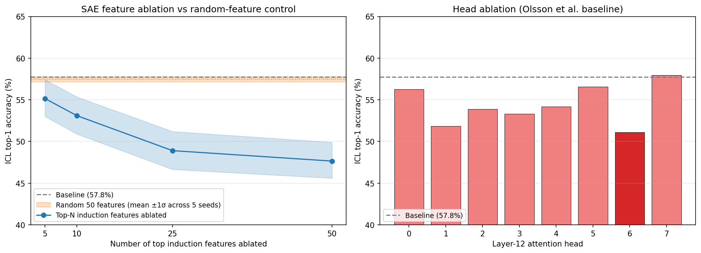

# Zero- and mean-ablation disagree about which head drives this SAE feature (Gemma-2-2B induction)

*Epistemic status: one model, one layer, three SAE training seeds. The qualitative finding replicates across all three seeds; the effect sizes are from one run and shouldn't be load-bearing without more replication. Code, weights and seeds linked below. Done on a consumer GPU in my spare time.*

## TL;DR

I trained a 16k TopK SAE on Gemma-2-2B layer 12 and found one obvious induction-style feature, F15289. I tried to localise it to a single attention head.

Zero-ablating head L12H3 cuts F15289 by 57%. Mean-ablating the same head doesn't cut it at all (it actually goes up 7%). I had a write-up half-drafted of the zero-ablation version as a clean one-head-one-feature circuit before I bothered to check the other ablation method.

This is the SAE-feature version of [Li & Janson (2024)](https://arxiv.org/abs/2409.09951)'s head-level finding that the three common ablation methods disagree by 3–10× on IOI. It rhymes with the [GDM SAE deprioritisation post](https://www.lesswrong.com/posts/4uXCAJNuPKtKBsi28/negative-results-for-saes-on-downstream-tasks) from earlier this year.

Practical takeaway: if you've got an SAE-feature → head attribution that came from zero-ablation, check it under mean-ablation before believing it. [Heimersheim & Nanda](https://arxiv.org/abs/2404.15255) describe mean-ablation as only "slightly more principled" than zero, but in this case "slightly" was the difference between a circuit existing and not.

What I didn't do: resample-ablation, other layers, other SAE widths, anything on real in-context learning rather than synthetic A-B-A.

Repo: [GitHub](https://github.com/sohumsen/sae-gemma-induction). Weights: [HF](https://huggingface.co/senator1/sae-gemma2-2b-layer12-v9c). Dashboard: [Streamlit](https://sae-gemma.streamlit.app/).

## Setup

Induction heads do something simple. Given `A B ... A`, predict B. [Olsson et al.](https://transformer-circuits.pub/2022/in-context-learning-and-induction-heads/index.html) worked this out in 2022 and it's been replicated to death since, which is exactly why I picked it: if SAEs can recover any known circuit at sub-head resolution, this is the one they should be able to recover.

The SAE: width 16k, TopK with k=100 (Gemma Scope's canonical L0 for this layer), trained on 200M tokens of layer-12 residuals from `google/gemma-2-2b`. Library: [`saprmarks/dictionary_learning`](https://github.com/saprmarks/dictionary_learning). 4.5 hours on an RTX 5070 Ti. Final explained variance 0.85, matching the published Gemma Scope numbers on this layer.

Probes: 2,000 sequences of the form `[random prefix] A B [short gap] A`, with the model predicting B. Baseline top-1 accuracy with the SAE patched in: about 58%. I scored each of the 16k features by (mean activation on induction probes) minus (mean activation on matched controls).

## The thing I almost got wrong

I picked the top-scoring feature, F15289, and tried to track down which head was upstream of it. Standard move: ablate each layer-12 head one at a time, measure what happens to F15289.

Under zero-ablation, head 3 cut F15289 by 57%. Head 6 (the head with the biggest effect on overall induction-task accuracy) only moved it by 12%. Confidence intervals didn't overlap. I had a draft in my notes that said something like "F15289 is the induction feature, head 3 is the head that drives it, here's the circuit."

Then I switched to mean-ablation, where instead of replacing the head output with zero you replace it with its mean output over the same probe distribution. That's in-distribution for the model; zero is not. The numbers came out very different:

| Head | Zero-abl | Mean-abl |
|---|---|---|
| 3 | −57% | +7% |
| 6 | −12% | +1% |
| 0 | −19% | +4% |
| 2 | ~0% | +14% |

Under mean-ablation no head moves F15289 by more than about 14%, and head 3 doesn't move it at all in the direction the zero-ablation result suggested. The clean circuit dissolves.


Head 6 isn't a non-story. There's a different feature in the SAE, F14740, which looks more like "tokens inside parallel/repeated phrasing" than pure copy-induction, and that one drops by about 30% under both ablation types when head 6 is hit. So head 6 is doing induction-adjacent work, just not for F15289 specifically.

Why the disagreement is this big: the model has never seen any of its attention heads output exactly zero during training. Forcing one to zero is OOD, and the network reacts unpredictably, sometimes by changing downstream features by a lot. Mean-ablation removes the head's variation around its mean, which is what I actually wanted to ask. Mechanistically the disagreement isn't surprising. What surprised me is that it was big enough to flip a "one head drives this feature" claim into a "no head drives this feature" claim.

The hook, for anyone reproducing:

```python
def mean_ablate_head(model, head_idx, layer, mean_output):
    def hook(module, input, output):
        output[:, :, head_idx, :] = mean_output[head_idx]
        return output
    return model.blocks[layer].attn.register_forward_hook(hook)
```

## F15289 is, in fact, an induction feature

Worth checking before going further: is F15289 actually doing what I think? I auto-interpreted it with Claude Sonnet on its top-20 activating snippets and got "detects the second occurrence of a repeated word or phrase within a short context window," which matches what I see in the snippets. Examples from C4 (bold = activating token):

- *"Never stop. **Never** break."*
- *"Tier 3 and **Tier** 4 merchants"*
- *"not too hot, **not** too cold"*


Sanity check on the other direction: F15289 doesn't fire on 4-shot MMLU prompts, real or shuffled. So it's a token-copying feature, not a general in-context-learning feature. If you wanted ICL features in this SAE, scoring on A-B-A probes wouldn't find them.

## How concentrated is the aggregate effect?

A side question I didn't expect to care about: how many SAE features carry the induction signal? Ablate the top N induction-scoring features at once and measure the drop in token-copying accuracy.

| Top-N ablated | Accuracy drop |
|---|---|
| 5  | 2.6pp |
| 10 | 4.7pp |
| 25 | 8.9pp |
| 50 | 10.1pp |

Random 50-feature controls drop accuracy by under 1pp, so the effect is real (about 35× over a random baseline). But it's spread thin. The top 5 carry less than a quarter of what the top 50 carry. For comparison, the biggest single attention-head ablation drops accuracy by about 6.6pp, so the top-50 SAE intervention does beat any single-head ablation, but only by being broad.



A small lesson I'd extract from this: a clean "ablate just N features and the task breaks" result is exactly the shape you'd get if your SAE were absorbing a distributed signal into whichever few features happened to score highest. The curve is more informative than the headline number. I'd be a little suspicious of any concentrated-circuit claim from SAE feature ablations that doesn't show the full curve.

## Robustness

**Seeds.** Retraining the SAE with two more random seeds, the top-50 ablation drop comes out to 10.1, 18.8, and 12.2pp (mean 13.7). The specific feature IDs shift around between seeds. What's stable: every seed's top-5 contains a feature that auto-interprets as the same "second occurrence of a recently-seen token" thing. The abstraction is robust. Treating individual feature IDs as load-bearing across seeds would be a mistake.

**Cross-SAE.** I re-ran the induction-score ranking on the Gemma Scope SAE for the same model and layer. As expected, feature IDs don't line up. But the top-20 mean induction score is 0.79 (mine) vs 0.78 (Gemma Scope). The distribution of feature properties matches even though no specific feature ID does. That feels like the right thing to compare across SAEs anyway.

## Where I think this leaves things

The narrow version of the result: on this one rank-1 SAE-feature → head attribution claim, on this one model and layer, the answer flips depending on which ablation method you pick, and there is no principled reason to prefer the zero answer over the mean one.

The broader version, which I'm less confident about: SAE-feature-level circuit claims are probably more sensitive to ablation choice than head-level ones, because SAE features are downstream of already-OOD-sensitive head outputs and the sensitivities stack. If that's roughly right, the methodology bar for "SAE feature X is driven by head Y" needs to be higher than people (including me, a week ago) have been treating it.

Things I want to flag as not yet established:

1. I only ran one SAE width (16k). I don't know if the gap between zero and mean ablation shrinks or grows at other widths.
2. I didn't run resample-ablation, where you replace a head's output with its output on a different probe. This is probably the right third comparison and would likely land between zero and mean. I'd be interested to see it.
3. The mean-ablation result is consistent with both "many heads each contribute a little" and "backup heads, any one is sufficient." I haven't done the dropout-style experiment to distinguish them. My weak prior (~60%) is the former for this feature, but not strongly.
4. I haven't shown anything on real ICL prompts, only synthetic A-B-A probes. F15289's behaviour on MMLU is some evidence that the synthetic-vs-real gap matters.

## Related work

- [Heimersheim & Nanda, "How to use and interpret activation patching"](https://arxiv.org/abs/2404.15255) (2024). The reference I went in with. They call mean ablation "slightly more principled" than zero; this post is one case where "slightly" did a lot of work.
- [Li & Janson, "Optimal Ablation for Interpretability"](https://arxiv.org/abs/2409.09951) (NeurIPS 2024). Head-level analogue of what I found: on IOI, optimal-vs-{zero, mean, resample} disagree by 3–10× for the median component.
- [Marks et al., "Sparse Feature Circuits"](https://arxiv.org/abs/2403.19647) (ICLR 2025). The canonical SAE-circuit paper. Uses mean ablation by default, which I'd now say is the right call.
- [Smith, Rajamanoharan, Conmy et al., "Negative Results for SAEs on Downstream Tasks..."](https://www.lesswrong.com/posts/4uXCAJNuPKtKBsi28/negative-results-for-saes-on-downstream-tasks) (GDM, 2025). Broader context for SAE-circuit fragility.
- [Makelov, Lange, Nanda, "An Interpretability Illusion for Activation Patching of Arbitrary Subspaces"](https://www.lesswrong.com/posts/RFtkRXHebkwxygDe2/an-interpretability-illusion-for-activation-patching-of). The "patching illusions" genre.
- [Lieberum et al., "Gemma Scope"](https://arxiv.org/abs/2408.05147). The reference SAE suite.
- [Olsson et al., "In-context Learning and Induction Heads"](https://transformer-circuits.pub/2022/in-context-learning-and-induction-heads/index.html) (Anthropic, 2022). The induction heads themselves.

## Reproducibility

Code: [GitHub](https://github.com/sohumsen/sae-gemma-induction). Weights: [HuggingFace](https://huggingface.co/senator1/sae-gemma2-2b-layer12-v9c) (v9c). Dashboard: [Streamlit](https://sae-gemma.streamlit.app/). Probes are `data/induction_probes_v3.jsonl` (n=2,000). Seeds: 42 main, 43 and 44 for replication. Total compute about 15h on one RTX 5070 Ti (4.5h SAE training, the rest experiments).

SAE training config (from `src/sae_gemma/train_sae_dl.py`, using `saprmarks/dictionary_learning`'s `TopKTrainer` + `AutoEncoderTopK`):

| | |
|---|---|
| Base model | `google/gemma-2-2b` (bfloat16) |
| Hook | `blocks.12.hook_resid_post` |
| `d_in` / `d_sae` | 2,304 / 16,384 |
| `k` (L0) | 100 (matches Gemma Scope canonical L0 here) |
| Training tokens | 200M (~97,656 steps at SAE batch 2,048) |
| Context length | 1,024 (BOS-excluded) |
| Dataset | `monology/pile-uncopyrighted` (streamed, cached) |
| Optimizer | Adam, lr 5e-5, 1,000-step warmup, linear decay starting at 80% |
| Aux loss | `auxk_alpha = 1/32`, k_aux = 2k |
| Threshold EMA | `threshold_beta = 0.999`, started at step 1,000 |
| Activation norm | constant-norm rescale, SAEBench convention |
| Autocast | bfloat16; weights stored as float32 |
| Final / peak EV | 0.85 / 0.893 |
| Dead features | 0 |

If you've done something similar and got different numbers, especially under resample-ablation or at other layers, I'd want to hear about it.

---

*Thanks to Neel Nanda for TransformerLens and for setting up much of the framing I'm leaning on, and to Sam Marks, Adam Karvonen, and the rest of the `dictionary_learning` and SAEBench contributors. The published Gemma SAE numbers were the breadcrumb that made this feasible on a consumer GPU.*